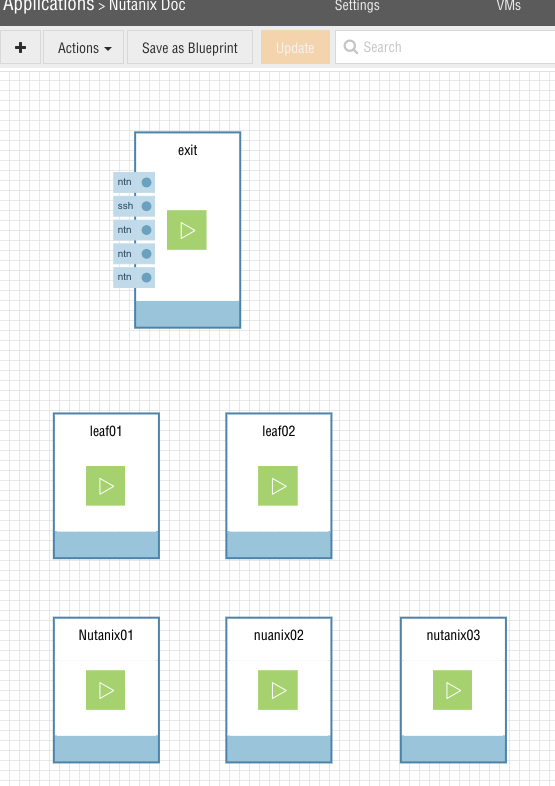

# Cumulus HCS Demo Guide

This will walk you through the process of using Cumulus Hyperconverged Service (HCS) on Ravello. 

* [Cumulus HCS Demo Guide](#cumulus-hcs-demo-guide)
   * [Getting Access](#getting-access)
      * [Run It Yourself](#run-it-yourself)
      * [Access From Cumulus](#access-from-cumulus)
   * [Topology](#topology)
      * [IP Addressing](#ip-addressing)
   * [Starting the lab](#starting-the-lab)
      * [Verify Nutanix VM Requirements](#verify-nutanix-vm-requirements)
      * [Start the Lab](#start-the-lab)
      * [Using the Lab](#using-the-lab)
      * [Access Nutanix Prism](#access-nutanix-prism)
      * [Create a VM](#create-a-vm)
      * [Migrate a VM](#migrate-a-vm)
      * [Create a Second VM](#create-a-second-vm)
      * [Powering Off a VM](#powering-off-a-vm)
      * [Viewing HCS Configuration](#viewing-hcs-configuration)
   * [More Information](#more-information)

## Getting Access
There are two options to see the Cumulus HCS in action:
* Run it yourself
* Access from Cumulus

### Run It Yourself
You can run this lab yourself by copying the Cumulus HCS demo Ravello Blueprint.
First, find the [Cumulus HCS blueprint](https://www.ravellosystems.com/repo/blueprints/3125675365237) on the Ravello Repo page.

<br />

On the Ravello Repo page, select "Add To Library", and agree to the Ravello Terms and Conditions and click "Add"

<br />
On the Ravello Blueprint page, click the "Create Application" button. Provide the application a Name and Click "Create"

With an application, you can follow the [Start the Lab](#start-the-lab) instructions below and walk through the rest of this lab guide.

### Access From Cumulus
If you'd like Cumulus to host this lab for you please contact sales@cumulusnetworks.com for assistance and we will schedule lab time for you.

## Topology


The topology consists of:

* 3 Nutanix nodes running Nutanix CE configured in a cluster
* 2 Cumulus Linux switches running Cumulus Vx 3.7.3 configured as an MLAG pair
* 1 Cumulus Linux switch (exit01) acting as a jump host to get to and from the environment

### IP Addressing

| Nutanix Node    | KVM IP    | CVM IP    | CVM Port |
| -------------   |----------:| ---------:|---------:|
| NTNX-4e6eac27-A | 10.1.1.10 | 10.1.1.11 | 9441     |
| NTNX-d618a06d-A | 10.1.1.20 | 10.1.1.21 | 9442     |
| NTNX-4e6eac27-A | 10.1.1.30 | 10.1.1.31 | 9443     |

*CVM Cluster IP: 10.1.1.123:9440*

| Leaf   | Loopback IP | CVM Vlan IP    |
| -------|------------:| --------------:|
| leaf01 | 10.0.0.11   | 10.1.1.100     |
| leaf02 | 10.0.0.12   | 10.1.1.200     |

*CVM VRR Gateway IP: 10.1.1.1*


## Starting the lab
From the Ravello canvas, you will see the 3 Nutanix nodes, two leafs and exit.


### Verify Nutanix VM Requirements
In order to run Nutanix CE on Ravello, you must enable nested virtualization on bare metal hosts. 
<br />
To do this, select the Nutanix VM then on the right-hand menu select `General` and then click the link at the bottom of the pane `Advanced Configuration`

<br />
Set `cpu-model` to *SandbyBridge* 
Set `preferPhysicalHost` to *true* _If you do not see this setting, open a case with Ravello support to enable it_ 
Click `OK` 
And then click `Save` when back on the right pane. 
 
Repeat this on all three Nutanix nodes. There are no settings to modify on either of the leaf nodes or the exit node.

### Start the Lab
Now the lab blueprint must be "published" to a Ravello datacenter.
<br />

Ravello gives the option of "Optimize for Cost" or "Optimize for Performance". Select `Performance`. 
Choose the location geographically closest to you.

Then click *Publish*. 
_Note: This lab will cost around $7/hr on Ravello due to the CPU and memory requirements of Nutanix AHV._
 
It will take 10 minutes or more for Ravello to copy all of the disk images and fully publish your lab. 
<br />
During this time you will see hourglass icons on all of the VMs while they boot. 

When all VMs have started the hourglass icon will be replaced with a green play button


### Using the Lab
When the lab is running you can SSH to the "exit" device. 

<br />

Look at the right "Summary" panel for "VM is started" and use the IP in that box to SSH to.

<br />

SSH to the "exit" node and login with  
username: `cumulus`  
password: `CumulusLinux!` 

<br />

From the exit node, you can ssh to either `leaf01` or `leaf02`. 
If you wish to access the Nutanix console you can also ssh to any Nutanix IP address. The Nutanix nodes use the following credentials
KVM host username: `root`  
KVM host password: `nutanix/4u`  
 
CVM host SSH username: `nutanix`  
CVM host SSH password: `nutanix/4u`

From `leaf01` view that the Nutanix nodes have been discovered via LLDP
```Shell
cumulus@leaf01:~$ net show lldp

LocalPort  Speed  Mode           RemoteHost       RemotePort
---------  -----  -------------  ---------------  ----------
eth0       1G     Mgmt           leaf02           eth0
swp1       1G     BondMember     NTNX-e08c61ec-A  ens3
swp2       1G     BondMember     NTNX-d618a06d-A  ens3
swp3       1G     BondMember     NTNX-4e6eac27-A  ens3
swp49      1G     BondMember     leaf02           swp49
swp50      1G     BondMember     leaf02           swp50
swp51      1G     NotConfigured  exit             swp1
```

You can also view the dynamically created bonds
```Shell
cumulus@leaf01:~$ net show interface bonds
    Name       Speed   MTU  Mode     Summary
--  ---------  -----  ----  -------  ----------------------------------
UP  bond_swp1  1G     1500  802.3ad  Bond Members: swp1(UP)
UP  bond_swp2  1G     1500  802.3ad  Bond Members: swp2(UP)
UP  bond_swp3  1G     1500  802.3ad  Bond Members: swp3(UP)
UP  peerlink   2G     1500  802.3ad  Bond Members: swp49(UP), swp50(UP)
```

View that MLAG (or Cumulus mLAG) is up and that these three bonds have been assigned `CLAG IDs`
```Shell
cumulus@leaf01:~$ net show clag
The peer is alive
     Our Priority, ID, and Role: 1000 44:38:39:00:01:49 primary
    Peer Priority, ID, and Role: 1000 44:38:39:00:02:49 secondary
          Peer Interface and IP: peerlink.4094 fe80::4638:39ff:fe00:249 (linklocal)
                      Backup IP:  (inactive)
                     System MAC: 44:38:39:ff:40:00

CLAG Interfaces
Our Interface      Peer Interface     CLAG Id   Conflicts              Proto-Down Reason
----------------   ----------------   -------   --------------------   -----------------
       bond_swp1   -                  9979      -                      -
       bond_swp3   -                  60756     -                      -
       bond_swp2   -                  7773      -                      -
```


Finally, view that only VLAN 1 has been programmed in the spanning-tree bridge 
```Shell
cumulus@leaf01:~$ net show bridge vlan

Interface  VLAN  Flags
---------  ----  ---------------------
bond_swp1     1  PVID, Egress Untagged
bond_swp2     1  PVID, Egress Untagged
bond_swp3     1  PVID, Egress Untagged
bridge        1
peerlink      1  PVID, Egress Untagged
```

You may repeat the same steps on `leaf02` to verify that the state of the network is the same on both leafs.

### Access Nutanix Prism
The same IP address we used to SSH to the `exit` node will be used to access the Prism web GUI. 

<br />

Again, from the Ravello canvas, look at the right "Summary" panel for "VM is started" and use the IP in that box.  
Connect to `https://<IP_ADDRESS>:9440`

You will receive a warning about the connection not being secure or about the SSL certificate.

<br />

Depending on the browser, click advanced and "Continue" or "Ignore".

<br />

_Note:_ The Prism services may take 10-15 minutes to start *after* the Nutanix VMs are online. Attempting to access the URL before the Prism services are online will result in an error that the page can not be found or `Oops - Server Error` message.

_Note:_ Prism is only accessible via *HTTPS* and will not redirect from HTTP. If you access the Prism IP via HTTP you will receive an `Oops - Server Error` message.

At the login screen, you can login with  
username: `admin`  
password: `1CumulusLinux!`  

After logging in you will be presented with the Prism Dashboard

This provides a wealth of data about the Nutanix cluster. As a consequence of the lab deployment and provisioning "Critical" alerts are expected and may be ignored or resolved.

### Create a VM
The Nutanix cluster that is provided as part of this lab contains three VM images: Ubuntu 18.04,  Cumulus Vx 3.7.2, Cirros0.4.0.  
Cirros is a very lightweight Linux distribution designed for testing cloud and hypervisor deployments. 
_Note:_ You may access the internet and add additional images to this cluster, however, due to how Ravello deploys VMs and how this lab is specifically built the throughput to the internet will be very low and may cause cluster instability. 

<br />

From the Prism dashboard click on "Home" to drop down the menu and select "VM"

The VM dashboard will indicate there are 3 VMs running, these are the 3 Controller VMs (CVMs) running on each of the three Nutanix nodes.
From the VM dashboard select "Table" table near the top left, next to "Overview".

<br />

Now, create the first VM by selecting "+ Create VM" from the right side of the screen.  
In the new window provide the VM a name, `1 vCPU` and `1 GiB` of Memory.  
Next, scroll down and remove the `CD-ROM` drive that is automatically added and select "+ Add New Disk"  
In the "Add Disk" window, under "Operation" select `Clone from Image Service`  
You may select any of the pre-populated VMs. For testing, Cirros is recommended due to its small footprint and speed. Select "Add".  
Scroll down further to "Network Adapters (NIC) and select "Add New NIC"  
In the "Create NIC" window `VLAN10` will be selected by default. Click "Add"  
Now select "Save" to create the VM. The VM is created, but powered off.  

<br />

Back in the "VM Table" view, select the VM, then click "Power On" below the table.  
When the VM is powered, AHV will notify the Cumulus Linux switches that a VM in VLAN 10 now exists and Cumulus HCS will create VLAN10 on the appropriate interfaces.  
You can view this change on either `leaf01` or `leaf02` with the command `net show bridge vlan`  

*_Tip:_* You can use the command `watch -n1 net show bridge vlan` to automatically run the command on repeat and watch the VLAN being created in real time. Use `ctrl + c` to exit out of the `watch` command.  

### Migrate a VM
<br />

Next, we can migrate a VM to another Nutanix node and see the VLANs automatically update on the Cumulus Linux switches.  
Again, in the "VM Table" view, select the VM and click "Migrate" from the bar below the table.  
This will bring up a list of Nutanix hosts in the cluster. Select another host and the Nutanix AHV hypervisor will migrate the VM.  

*_Note:_* Nutanix automatically determines where to deploy the VM the first time the VM is created. When selecting a host to migrate to, select a host that is not currently running the VM. You can look at the `net show bridge vlan` output to easily see which Nutanix node is currently hosting the VM.

| Bond Interface | Nutanix IP  |
| ---------------|------------:| 
| bond_swp1      | 10.0.0.10   | 
| bond_swp2      | 10.0.0.20   | 
| bond_swp3      | 10.0.0.30   | 

Again using the command `net show bridge` before and after the VM migration action will show the VLAN has moved. You can also use `watch -n1 net show bridge vlan` to see the change in real-time.

### Create a Second VM
<br />

Now, create a second VM in VLAN 20. Within Prism select "+ Create VM" on the right side of the VM screen.  
Follow the same steps as before to add `1 vCPU`, `1 GiB` of Memory and remove the default `CD-ROM` disk.  
Add a new Disk that is a `Clone from Image Service` and select `Cirros` again. 
Finally, `Add New NIC` and this time select `VLAN20` from the dropdown menu.  
Save the VM.

<br />

Again, select the VM within the table and click "Power On" in the bar below the VM table. As the VM powers on you can view the new `VLAN 20` created and added with the output `net show bridge vlan` from a Cumulus Linux Device.

### Powering Off a VM
<br />
As a final test, select either VM from the VM Table and in the bar below select "Power Off Actions" and "Power Off".  
Once the VM is powered off, with no remaining hosts in that VLAN, Cumulus HCS removes the VLAN from the switchports.  
Again, view the change with `net show bridge vlan`

### Viewing HCS Configuration
The Cumulus HCS configuration is kept in `/etc/default/cumulus-hyperconverged` 
```Shell
cumulus@leaf01:~$ cat /etc/default/cumulus-hyperconverged
### /etc/default/cumulus-hyperconverged config file
# username for Prism (required)
USERNAME=admin
# password for Prism (required)
PASSWORD=1CumulusLinux!
# CVM address used by the service (required)
SERVER=10.1.1.11
# Hook server address (optional)
#HOOK_SERVER=10.0.0.0
# Hook port (optional)
#HOOK_PORT=10.0.0.0
# Socket timeout (optional)
#SOCKET_TIMEOUT=10.0.0.0
# single/multi rack configuration (optional)
VXLAN_CONFIG=False
# loglevel: verbose/debug (optional)
#LOGLEVEL=verbose
# periodic sync timeout (optional)
#PERIODIC_SYNC_TIMEOUT=60
```

_Note:_ Within the Ravello lab a setting called `IPMI_BYPASS=True` may be seen. This is required due to limitations of the Nutanix API and Ravello. 

Any changes to the `cumulus-hyperconverged` configuration file are applied with `systemctl restart cumulus-hyperconverged.service`.  
_Note:_  Restarting the `cumulus-hyperconverged` service will cause any dynamically created bonds to be removed and recreated, causing a loss of link to the Nutanix cluster. Restarting the service on both leaf switches simultaneously will create a cluster outage.  

You can view the status of Cumulus HCS with `systemctl status cumulus-hyperconverged.service`
```Shell
cumulus@leaf01:~$ sudo systemctl status cumulus-hyperconverged.service
● cumulus-hyperconverged.service - Cumulus Linux Hyperconverged Daemon
   Loaded: loaded (/lib/systemd/system/cumulus-hyperconverged.service; enabled)
   Active: active (running) since Sat 2019-01-26 22:01:53 UTC; 8min ago
 Main PID: 1131 (cumulus-hyperco)
   CGroup: /system.slice/cumulus-hyperconverged.service
           ├─1131 /usr/bin/python /usr/bin/cumulus-hyperconverged
           └─1220 /usr/sbin/lldpcli -f json watch

Jan 26 22:09:41 leaf01 ip[1131]: 10.1.1.31 - - [26/Jan/2019 22:09:41] "POST /hooks HTTP/1.1" 200 -
Jan 26 22:10:03 leaf01 cumulus-hyperconverged[1131]: VM VM_in_VLAN20 added
```

## More Information
For even more information about the Cumulus Hyperconverged Service, please vist the [Cumulus Networks HCI portal](https://cumulusnetworks.com/networking-solutions/converged-infrastructure/).